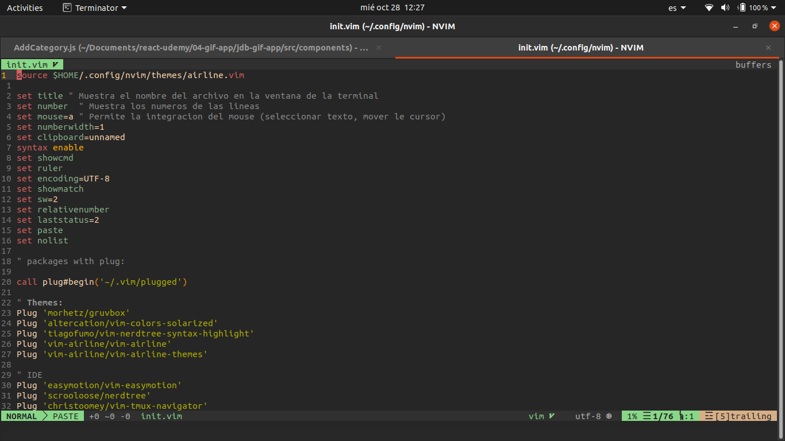

# Config_Neovim

> My personal neovim settings.

## Table of contents

- [General info](#general-info)
- [Screenshots](#screenshots)
- [Technologies](#technologies)
- [Contact](#contact)

## General info

My personal neovim settings including themes and settings the airline status bar.:sunglasses: :nail_care: :+1:

## Screenshots

## Technologies

- Vim

## Contact

Created by [@jhosep98](https://jhosep98.github.io/Portfolio2020jdb/) - feel free to contact me!
